# QuickScan Pro 🚀

**QuickScan Pro** is a high-performance, premium QR and barcode scanner built with Flutter. Designed for speed, reliability, and a stunning user experience, it offers smart actions for various scan types, localized storage, and a powerful QR code generator.



## ✨ Key Features

-   **⚡ Lightning Fast Scanning**: Instant detection of all standard 1D and 2D barcode formats.
-   **💎 Premium UI/UX**: Modern glassmorphic design with smooth animations and full Light/Dark mode support.
-   **🏦 Smart Payment Integration**: Seamlessly scan-to-pay with integrated **UPI** detection and native app launching.
-   **📂 Smart History**: All scans are saved locally with automatic deduplication and favoriting.
-   **🎨 Pro QR Generator**: Create custom QR codes for URLs, WiFi, Contacts, and more with persistent drafts.
-   **🛡️ Privacy First**: All scan data remains on your device. No cloud syncing required.
-   **🌐 Accessibility & Performance**: Fully optimized with `RepaintBoundary` for 60fps performance and `Semantics` for accessibility.

## 🛠️ Technical Stack

-   **Framework**: [Flutter](https://flutter.dev)
-   **State Management**: [Riverpod](https://riverpod.dev)
-   **Local Database**: [Hive](https://docs.hivedb.dev) & [SharedPreferences](https://pub.dev/packages/shared_preferences)
-   **Scanning Engine**: [mobile_scanner](https://pub.dev/packages/mobile_scanner)
-   **Theming**: Custom dynamic theme system with glassmorphism.

## 🏗️ Architecture

QuickScan Pro follows a **Feature-First Architecture** for maximum scalability and maintainability:

```text
lib/
├── core/           # Shared themes, constants, navigation, and utilities
├── data/           # Models and local data persistence layer
├── features/       # Feature-specific logic and UI
│   ├── scanner/    # Real-time scanning and result processing
│   ├── history/    # Local scan history management
│   ├── generator/  # Custom QR generation and customization
│   └── settings/   # App configuration and themes
└── main.dart       # App initialization and entry point
```

## 🧪 Quality Assurance

-   **Static Analysis**: 100% clean `flutter analyze` report with zero warnings.
-   **Unit Testing**: Comprehensive test suite for content analysis and deduplication logic.
-   **Performance**: Optimized rendering paths for low-latency scanning.

---
Built with ❤️ for a world-class scanning experience.
